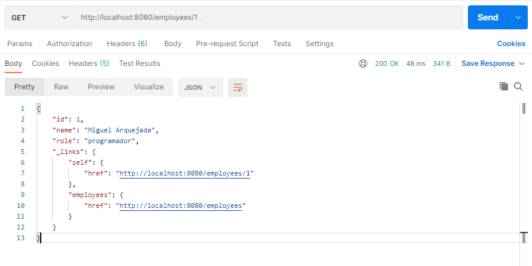

# Projeto introdução ao Spring Boot - construindo uma API Restful

> Nesse projeto iremos elabora uma _API Restful_ para o gerenciamento de funcionários de uma empresa. 

### Tecnologias usadas:
* **Spring boot**: forma simples e fácil de iniciar uma aplicação spring
* **Spring MVC**: nos permite utilizar a arquitetura model, view, controller
* **Spring Hateoas**: auxilia os clientes na navegação pela API
* **Spring JPA** : lidar com a persistência de dados de forma simples
* **Banco H2**: armazenamento em memória

### Endpoints:
* [ GET ] /employees
* [ GET ] /employees/{id}
* [ POST ] /employees
* [ PUT ] /employees/{id}
* [ DELETE] /employees/{id}
 

[Projeto na documentação oficial do Spring](https://spring.io/guides/tutorials/rest/)

